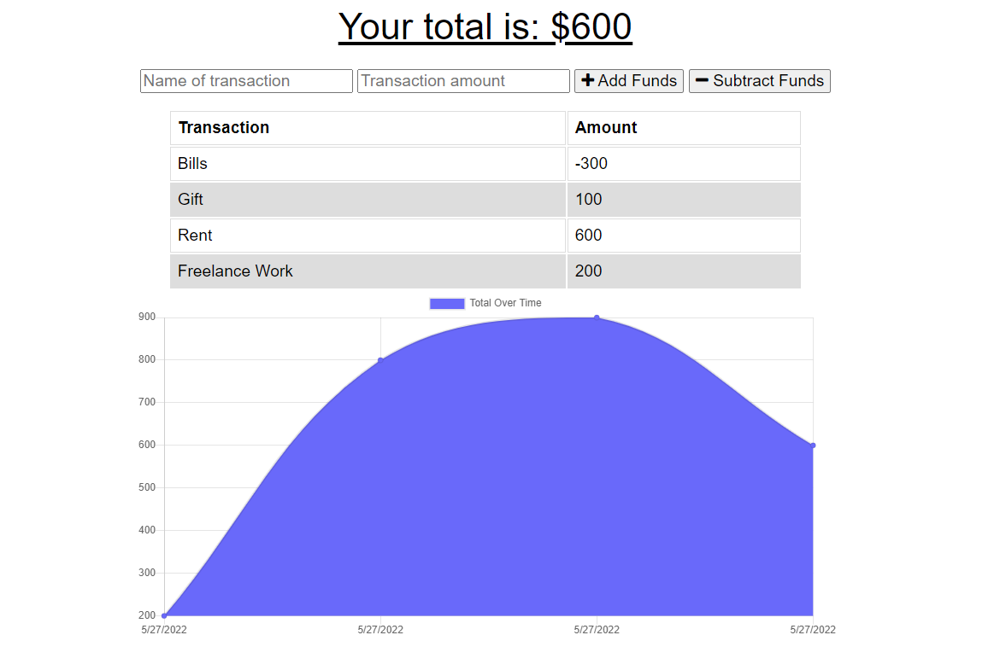

# Budge It Tracker 

## Description

This program will allow you to create entries based on past transactions. You can add and subtract funds to change the number, a graph will show the progress of your balance

## Table of contents

- [Usage](#usage)
- [Credits](#credits)
- [License](#license)

## Usage

Navigate to https://budge-it-tracker.herokuapp.com/

Enter in whatever transactions you would like to track, select add funds or subtract funds and watch it move!

## Credits

Just me and Stack Overflow!

## License

Licenses under MIT - https://opensource.org/licenses/MIT